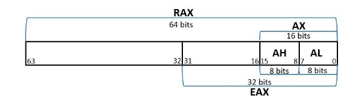
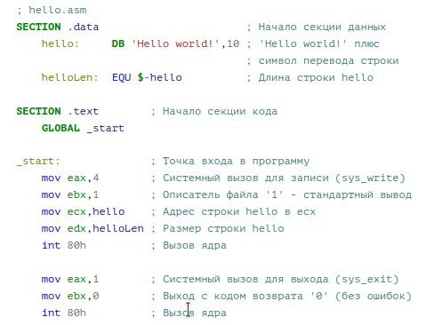
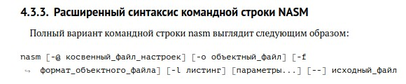
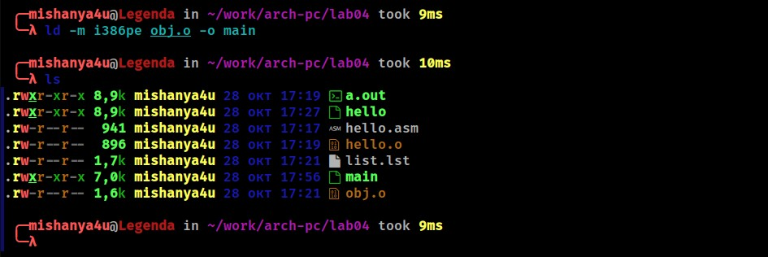

<meta http-equiv="Content-type" content="text/html;charset=utf-8">

---
## Front matter

        title: "Отчет по лабораторной работы №4"
        subtitle: "Архитектура компьютеров и Операционные системы"
        author: "Ван Сихэм Франклин О' Нил Джон (Миша)"
        group: "НПИбд-03-23"
        date: "13/10/2023"

## Bibliography

        bibliography: bib/cite.bib
        csl: pandoc/csl/gost-r-7-0-5-2008-numeric.csl

## Generic otions

        lang: ru-RU
        toc-title: "Содержание"

## Pdf output format

        toc: true # Table of contents
        toc-depth: 2
        lof: true # List of figures
        lot: true # List of tables
        fontsize: 12pt
        linestretch: 1.5
        papersize: a4
        documentclass: scrreprt

## I18n polyglossia

        polyglossia-lang:
            name: russian
            options:
                - spelling=modern
                - babelshorthands=true
        polyglossia-otherlangs:
            name: english

## I18n babel

        babel-lang: russian
        babel-otherlangs: english

## Fonts

        mainfont: DejaVuSerif
        romanfont: Times New Roman
        sansfont: DejaVuSans
        monofont: DejaVuSansMono
        mainfontoptions: Ligatures=TeX
        romanfontoptions: Ligatures=TeX
        sansfontoptions: Ligatures=TeX,Scale=MatchLowercase
        monofontoptions: Scale=MatchLowercase,Scale=0.9

## Biblatex

        biblatex: true
        biblio-style: "gost-numeric"
        biblatexoptions:
            - parentracker=true
            - backend=biber
            - hyperref=auto
            - language=auto
            - autolang=other*
            - citestyle=gost-numeric

## Pandoc-crossref LaTeX customization

        figureTitle: "Рис."
        tableTitle: "Таблица"
        listingTitle: "Листинг"
        lofTitle: "Список иллюстраций"
        lotTitle: "Список таблиц"
        lolTitle: "Листинги"

## Misc options

        indent: true
        header-includes:
            - \usepackage{indentfirst}
            - \usepackage{float} # keep figures where there are in the text
            - \floatplacement{figure}{H} # keep figures where there are in the text

---

# Цель работы

Освоение процедуры компиляции и сборки программ, написанных на ассемблере NASM.

# Теоретическое введение

## Основные принципы работы компьютера

Также, регистры процессора могут использоваться для хранения адресов памяти, указателей на данные и инструкции, а также для выполнения операций сдвига и логических операций.

Память в ЭВМ используется для хранения данных и программ. Она делится на оперативную память (ОП) и постоянную память (ПП). Оперативная память используется для временного хранения данных и программ, которые активно используются процессором. Постоянная память используется для хранения данных и программ на постоянной основе.

Периферийные устройства включают в себя устройства ввода и вывода. Устройства ввода используются для передачи данных в компьютер, например клавиатура и мышь. Устройства вывода используются для вывода данных из компьютера, например монитор и принтер. Также существуют устройства, которые могут выполнять как функции ввода, так и вывода, например жесткий диск.

Взаимодействие между центральным процессором, памятью и периферийными устройствами осуществляется через общую шину. Шина представляет собой набор проводников, по которым передается информация между устройствами. Шина может быть разделена на несколько частей, например шина данных, шина адреса и шина управления.

В целом, основными функциональными элементами любой ЭВМ являются центральный процессор, память и периферийные устройства, которые взаимодействуют через общую шину.

<hr><br>


Доступ к регистрам осуществляется не по адресам, как к основной памяти, а по именам. Каждый регистр процессора архитектуры x86 имеет свое название, состоящее из 2 или 3 букв латинского алфавита.
В качестве примера приведем названия основных регистров общего назначения (именно
эти регистры чаще всего используются при написании программ):
- RAX, RCX, RDX, RBX, RSI, RDI — 64-битные
- EAX, ECX, EDX, EBX, ESI, EDI — 32-битные
- AX, CX, DX, BX, SI, DI — 16-битные
- AH, AL, CH, CL, DH, DL, BH, BL — 8-битные (половинки 16-битных регистров). Например, AH (high AX) — старшие 8 бит регистра AX, AL (low AX) — младшие 8 бит регистра AX.


<hr><br>

# Ассемблер и язык ассемблера

Язык ассемблера (Assembler) - это низкоуровневый язык программирования, который используется для написания программ, близких к машинному коду. Он позволяет программисту работать непосредственно с регистрами процессора, адресами памяти и инструкциями процессора.

NASM (Netwide Assembler) - это один из популярных ассемблеров, который поддерживает различные архитектуры процессоров, включая x86 и x86-64. Он предоставляет широкий набор инструкций и возможностей для работы с памятью, регистрами и периферийными устройствами.

Основные особенности языка ассемблера NASM:

1. Синтаксис: NASM использует синтаксис Intel, который характеризуется использованием мнемоник инструкций, операндов и директив для определения символов и констант.

2. Регистры: NASM предоставляет доступ к регистрам процессора, таким как общего назначения (например, EAX, EBX), указателей (например, ESP, EBP), индексных (например, ESI, EDI) и флагового (например, EFLAGS).

3. Макросы: NASM поддерживает использование макросов, которые позволяют определить повторяющиеся фрагменты кода и использовать их в различных местах программы.

4. Директивы: NASM предоставляет различные директивы для управления процессом сборки программы, такие как директивы определения символов, выравнивания памяти и включения внешних файлов.

5. Операнды: NASM поддерживает различные типы операндов, включая регистры, адреса памяти, константы и метки.

6. Ввод-вывод: NASM предоставляет инструкции для работы с периферийными устройствами, такими как чтение и запись данных из/в портов ввода-вывода.

Язык ассемблера NASM позволяет программисту иметь полный контроль над процессором и памятью компьютера, что делает его мощным инструментом для разработки низкоуровневых программ и оптимизации кода. Однако, из-за своей низкоуровневости, он требует от программиста глубокого понимания аппаратного обеспечения и особенностей конкретной архитектуры процессора.

# Процесс создания и обработки программы на языке ассемблера

Процесс создания ассемблерной программы можно изобразить в виде следующей схемы

<hr><br>

Процесс создания и обработки программы на языке ассемблера включает следующие шаги:

1. Написание исходного кода: Программист пишет исходный код программы на языке ассемблера, используя мнемоники инструкций, операнды и директивы.

2. Ассемблирование: Исходный код программы передается ассемблеру (например, NASM), который преобразует его в машинный код, состоящий из набора инструкций процессора.

3. Связывание: Если программа использует внешние функции или библиотеки, необходимо выполнить связывание, чтобы объединить машинный код программы с кодом этих функций или библиотек.

4. Создание исполняемого файла: После связывания создается исполняемый файл, который может быть запущен на целевой системе.

5. Тестирование и отладка: Исполняемый файл тестируется и отлаживается для обнаружения и исправления ошибок и неправильного поведения программы.

6. Оптимизация: При необходимости программу можно оптимизировать для улучшения ее производительности или уменьшения размера исполняемого файла.

7. Развертывание: Исполняемый файл программы развертывается на целевой системе и запускается для выполнения заданной функциональности.

Весь этот процесс требует от программиста глубокого понимания аппаратного обеспечения и особенностей конкретной архитектуры процессора, чтобы эффективно использовать возможности языка ассемблера и создавать оптимизированный и надежный код.

# Порядок выполнения лабораторной работы
## Программа Hello world!

> Рассмотрим пример простой программы на языке ассемблера NASM. Традиционно первая
программа выводит приветственное сообщение Hello world! на экран.
Создайте каталог для работы с программами на языке ассемблера NASM:

```
mkdir -p ~/work/arch-pc/lab04
```

> Перейдите в созданный каталог:

```
cd ~/work/arch-pc/lab04
```

> Создайте текстовый файл с именем hello.asm:

```
touch hello.asm
```

> Откройте этот файл с помощью любого текстового редактора, например, gedit:

```
gedit hello.asm
```

<hr><br>

> И введите в него следующий текст:

<hr><br>

<hr><br>

## Транслятор NASM

> NASM превращает текст программы в объектный код. Например, для компиляции приве-
дённого выше текста программы «Hello World» необходимо написать:

```
nasm -f elf hello.asm
```

Если текст программы набран без ошибок, то транслятор преобразует текст программы
из файла hello.asm в объектный код, который запишется в файл hello.o. Таким образом, имена всех файлов получаются из имени входного файла и расширения по умолчанию. При наличии ошибок объектный файл не создаётся, а после запуска транслятора появятся сообщения об ошибках или предупреждения. С помощью команды ls проверьте, что объектный файл был создан. Какое имя имеет объектный файл?<br>
- main<br>

NASM не запускают без параметров. Ключ -f указывает транслятору, что требуется создать бинарные файлы в формате ELF. Следует отметить, что формат elf64 позволяет создавать исполняемый код, работающий под 64-битными версиями Linux. Для 32-битных версий ОС указываем в качестве формата просто elf. NASM всегда создаёт выходные файлы в текущем каталоге.


<hr><br>


## Расширенный синтаксис командной строки NASM

Полный вариант командной строки nasm выглядит следующим образом:<br>

<hr><br>

Выполните следующую команду:<br>
nasm -o obj.o -f elf -g -l list.lst hello.asm <br><br>
Данная команда скомпилирует исходный файл hello.asm в obj.o (опция -o позволяет
задать имя объектного файла, в данном случае obj.o), при этом формат выходного файла будет elf, и в него будут включены символы для отладки (опция -g), кроме того, будет создан файл листинга list.lst (опция -l). С помощью команды ls проверьте, что файлы были созданы. Для более подробной информации см. man nasm. Для получения списка форматов объектного файла см. nasm -hf.

## Компоновщик LD
Как видно из схемы на рис. 4.3.3, чтобы получить исполняемую программу, объектный файл необходимо передать на обработку компоновщику:

```
ld -m elf_i386 hello.o -o hello
```


<hr><br>

С помощью команды ls проверьте, что исполняемый файл hello был создан.
Компоновщик ld не предполагает по умолчанию расширений для файлов, но принято
использовать следующие расширения:<br>
1. o – для объектных файлов;
2. без расширения – для исполняемых файлов;
3. map – для файлов схемы программы;
4. lib – для библиотек.<br>
Ключ -o с последующим значением задаёт в данном случае имя создаваемог исполняемого файла.<br><br>
Выполните следующую команду:

```
ld -m i386pe obj.o -o main
```

<hr><br>

Какое имя будет иметь исполняемый файл? Какое имя имеет объектный файл из которого
собран этот исполняемый файл?
Формат командной строки LD можно увидеть, набрав ld --help. Для получения более
подробной информации см. man ld.

## Запуск исполняемого файла

Запустить на выполнение созданный исполняемый файл, находящийся в текущем каталоге, можно, набрав в командной строке:

```
./hello
```


<hr><br>


## Задание для самостоятельной работы

1. В каталоге ~/work/arch-pc/lab04 с помощью команды cp создайте копию файла
hello.asm с именем lab4.asm

<hr><br>

2. С помощью любого текстового редактора внесите изменения в текст программы в
файле lab4.asm так, чтобы вместо Hello world! на экран выводилась строка с вашими
фамилией и именем.

<hr><br>
<hr><br>

3. Оттранслируйте полученный текст программы lab4.asm в объектный файл. Выполните
компоновку объектного файла и запустите получившийся исполняемый файл.

<hr><br>

4. Скопируйте файлы hello.asm и lab4.asm в Ваш локальный репозиторий в каталог ~/work/study/2023-2024/"Архитектура компьютера"/arch-pc/labs/lab04/. Загрузите файлы на Github.

<hr><br>


# Заключение


Могу сказать что зыка ассемблера является важным шагом в развитии навыков программирования. Он позволяет программисту получить глубокое понимание работы компьютера и управления аппаратурой. Изучение ассемблера помогает развить навыки оптимизации кода и повысить производительность программ. Также этот язык открывает двери для изучения более высокоуровневых языков программирования, которые обеспечивают более высокий уровень абстракции и удобство написания кода. Знание этого языка помогает программисту лучше понять, как работает компилятор и какие инструкции выполняются на низком уровне.


