---
## Front matter
title: "Лабораторная работа №5 <p>Midnight Commander</p>"
subtitle: "Архитектура компьютера и Операционные системы"
author: "Ван Сихэм Франклин О Нил Джон"


## Generic otions
lang: ru-RU
toc-title: "Содержание"


## Bibliography
bibliography: bib/cite.bib
csl: pandoc/csl/gost-r-7-0-5-2008-numeric.csl

## Pdf output format
toc: true # Table of contents
toc-depth: 2
lof: true # List of figures
lot: true # List of tables
fontsize: 12pt
linestretch: 1.5
papersize: a4
documentclass: scrreprt

## I18n polyglossia
polyglossia-lang:
  name: russian
  options:
	- spelling=modern
	- babelshorthands=true
polyglossia-otherlangs:
  name: english

## I18n babel
babel-lang: russian
babel-otherlangs: english

## Fonts
mainfont: PT Serif
romanfont: PT Serif
sansfont: PT Sans
monofont: PT Mono
mainfontoptions: Ligatures=TeX
romanfontoptions: Ligatures=TeX
sansfontoptions: Ligatures=TeX,Scale=MatchLowercase
monofontoptions: Scale=MatchLowercase,Scale=0.9

## Biblatex
biblatex: true
biblio-style: "gost-numeric"
biblatexoptions:
  - parentracker=true
  - backend=biber
  - hyperref=auto
  - language=auto
  - autolang=other*
  - citestyle=gost-numeric

## Pandoc-crossref LaTeX customization
figureTitle: "Рис."
tableTitle: "Таблица"
listingTitle: "Листинг"
lofTitle: "Список иллюстраций"
lotTitle: "Список таблиц"
lolTitle: "Листинги"

## Misc options
indent: true
header-includes:
  - \usepackage{indentfirst}
  - \usepackage{float} # keep figures where there are in the text
  - \floatplacement{figure}{H} # keep figures where there are in the text

## pandoc-tablenos

pandoc-tablenos:
 - \usepackage{caption}

pandoc-tablenos:
 - \makeatletter
 - \newcounter{tableno}
 - \newenvironment{tablenos:no-prefix-table-caption}{
  	- \caption@ifcompatibility{}{
		- \let\oldthetable\thetable
		- \let\oldtheHtable\theHtable
		- \renewcommand{\thetable}{tableno:\thetableno}
		- \renewcommand{\theHtable}{tableno:\thetableno}
		- \stepcounter{tableno}
		- \captionsetup{labelformat=empty}
	  }
	}{
	- \caption@ifcompatibility{}{
		- \captionsetup{labelformat=default}
		- \let\thetable\oldthetable
		- \let\theHtable\oldtheHtable
		- \addtocounter{table}{-1}
	 }
	}
 - \makeatother
 
 ## MD
reader: markdown
writer: html5

---


# Цель работы

Приобретение практических навыков работы в Midnight Commander. Освоение инструкций языка ассемблера mov и int.

# Введение 

Midnight Commander (или просто mc) — это программа, которая позволяет просматривать структуру каталогов и выполнять основные операции по управлению файловой системой, т.е. mc является файловым менеджером. Midnight Commander позволяет сделать работу с файлами более удобной и наглядной. Для активации оболочки Midnight Commander достаточно ввести в командной строке mc и нажать клавишу Enter. В Midnight Commander используются функциональные клавиши F1 — F10, к которым привязаны часто выполняемые операции.

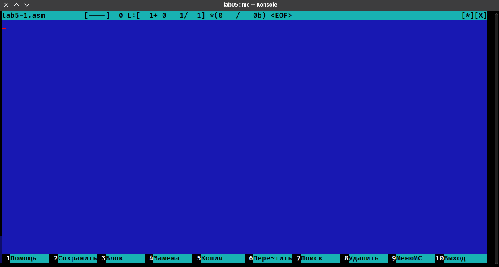<hr><hr>

<br>

# Порядок выполнения лабораторной работы

1. <ins>Откройте Midnight Commander</ins>
```python
print(mishanya4u@Legenda in ~ via C v13.2.1-gcc)
>> mc
```


<hr><hr>

<br>

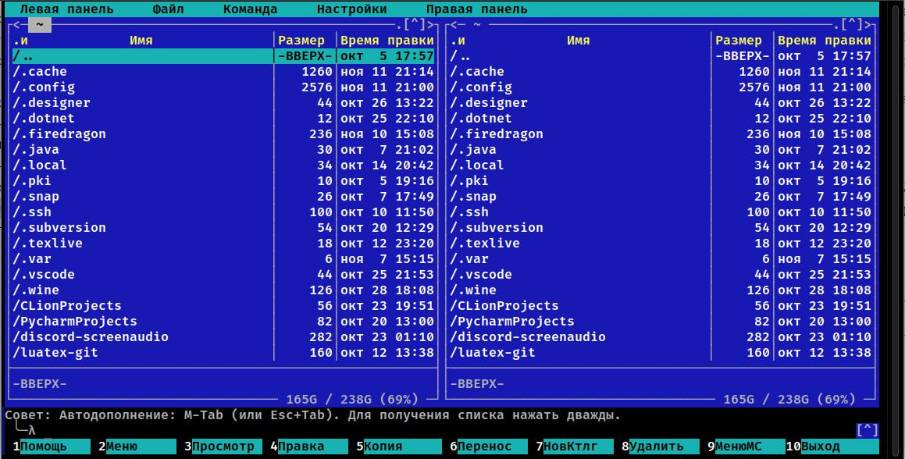<hr><hr>

<br>


2. <p> 
<ins>Пользуясь клавишами &#8593; , &#8595; и Enter перейдите в каталог ~/work/arch-pc созданный при выполнении лабораторной работы №4.</ins> 
</p>


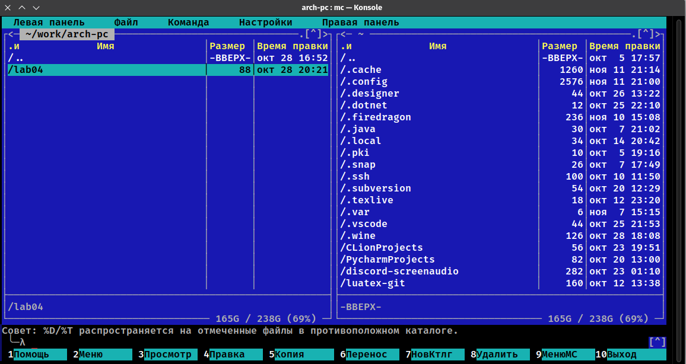<hr><hr>

<br>


3. <ins>С помощью функциональной клавиши F7 создайте папку lab05 и перейдите в созданный каталог.</ins>


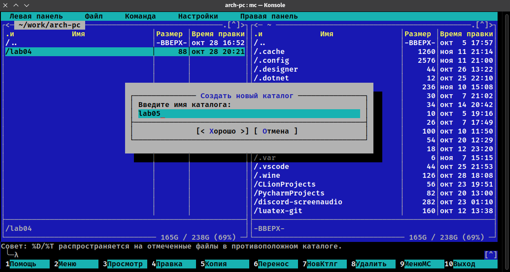<hr><hr>

<br>

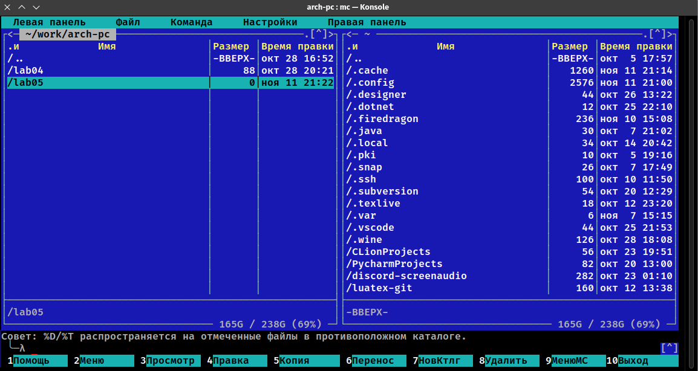<hr><hr>

<br>


4. <ins>Пользуясь строкой ввода и командой touch создайте файл lab5-1.asm.</ins>

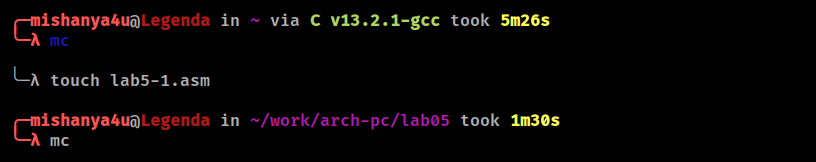<hr><hr>

<br>

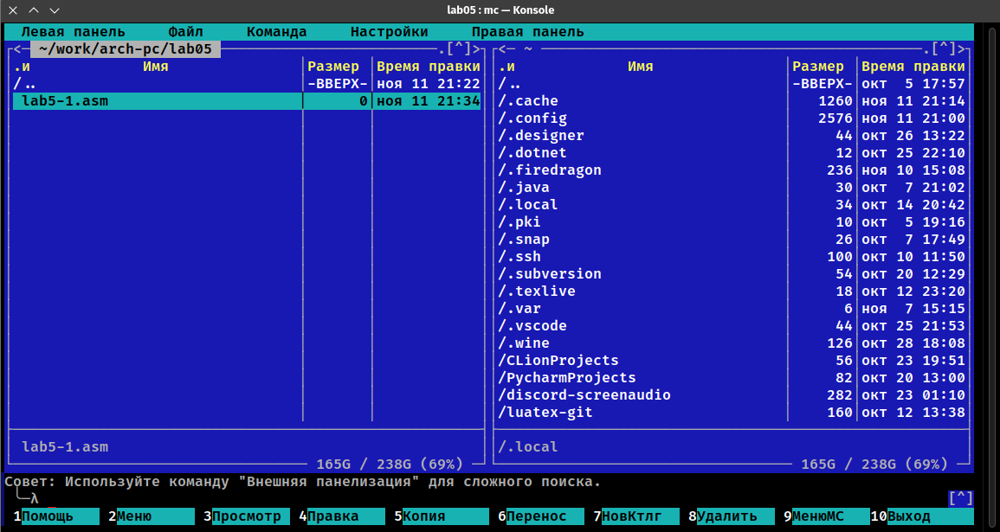<hr><hr>

<br>


5. <ins>С помощью функциональной клавиши F4 откройте файл lab5-1.asm для редактирования во встроенном редакторе. Как правило в качестве встроенного редактора Midnight Commander используется редактор mcedit.</ins>


<hr><hr>

<br>


6. <ins>Введите текст программы из листинга 5.1, сохраните изменения и закройте файл.</ins>


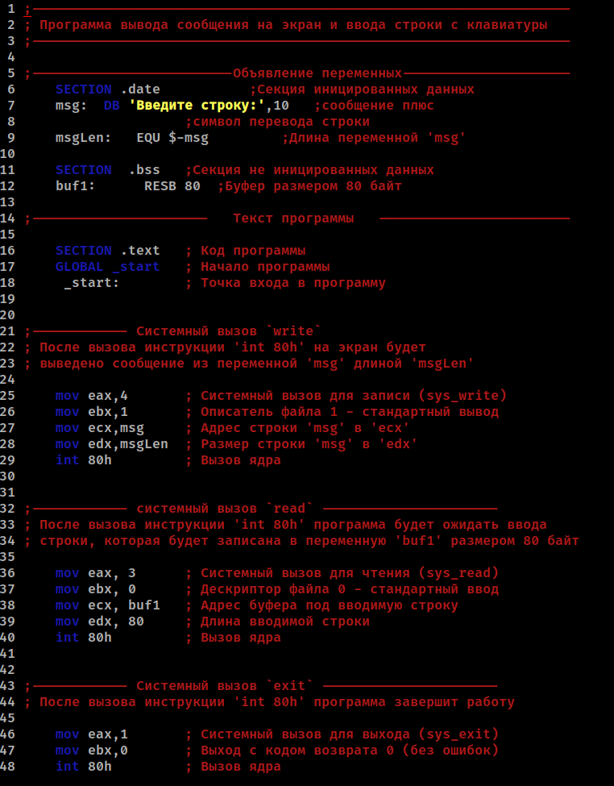<hr><hr>

<br>

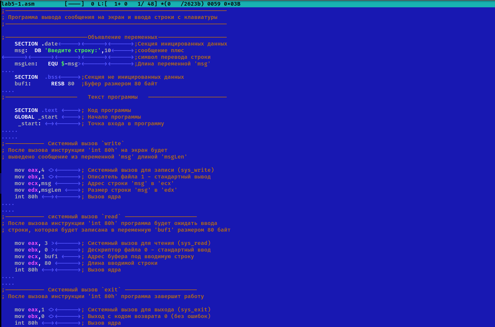<hr><hr>

<br>


7. <ins>С помощью функциональной клавиши F3 откройте файл lab5-1.asm для просмотра. Убедитесь, что файл содержит текст программы.</ins>


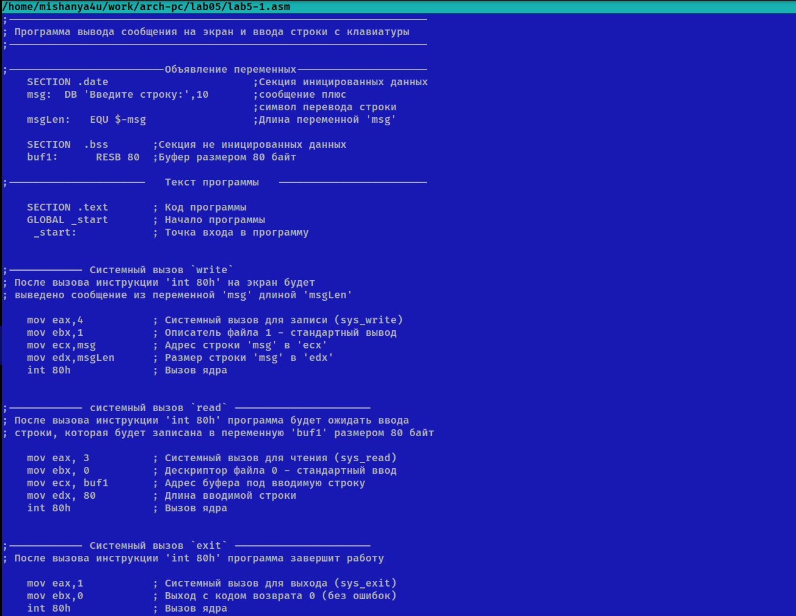<hr><hr>

<br>


8. <ins>Оттранслируйте текст программы lab5-1.asm в объектный файл. Выполните компоновку объектного файла и запустите получившийся исполняемый файл. Программа выводит строку 'Введите строку:' и ожидает ввода с клавиатуры. На запрос введите Ваши ФИО.</ins>

<font color="red">mishanya4u@Legenda in ~ via C v13.2.1-gcc</font>
```python
print(nasm -f elf lab5-1.asm)
```


<font color="red">mishanya4u@Legenda in ~ via C v13.2.1-gcc</font>
```python
print(ld -m elf_i386 -o lab5-1 lab5-1.o)
```


<font color="red">mishanya4u@Legenda in ~ via C v13.2.1-gcc</font>
```python
print(./lab5-1)
```


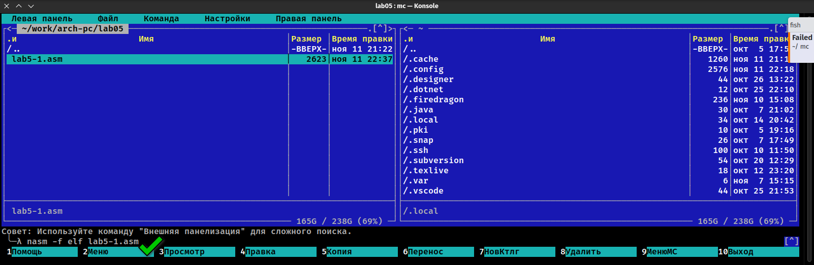<hr><hr>

<br>

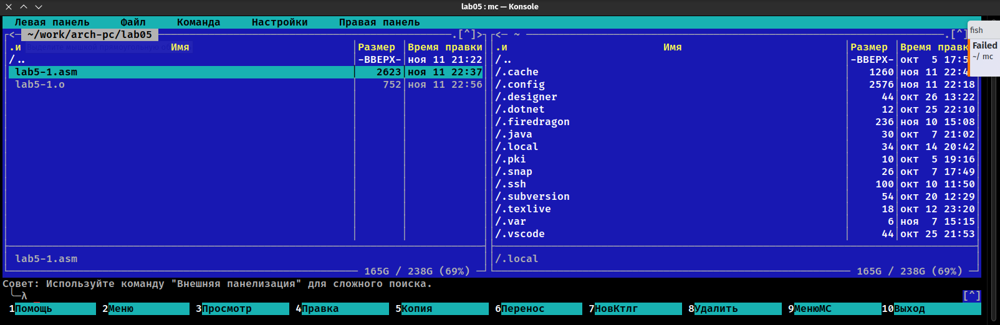<hr><hr>

<br>

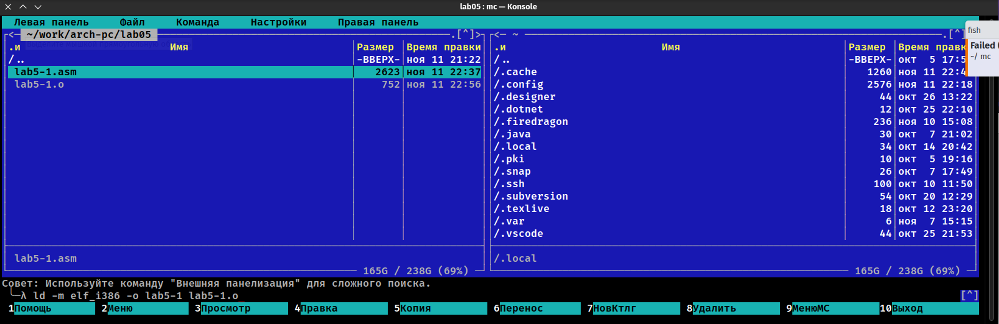<hr><hr>

<br>

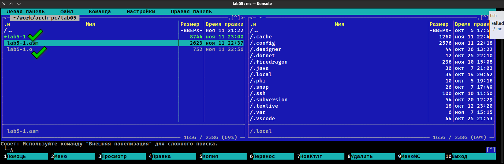<hr><hr>

<br>

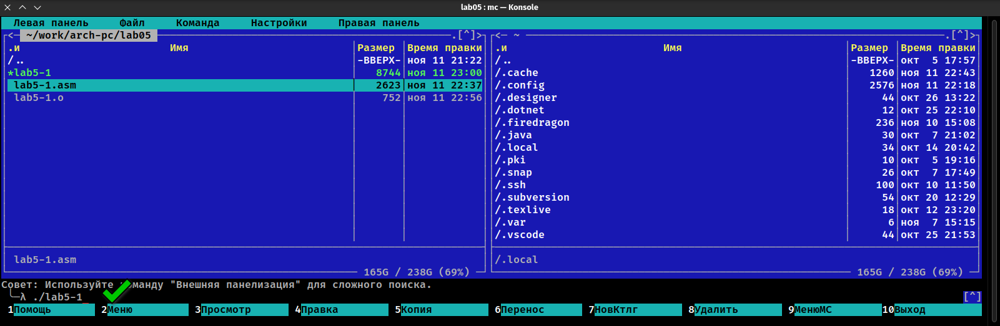<hr><hr>

<br>

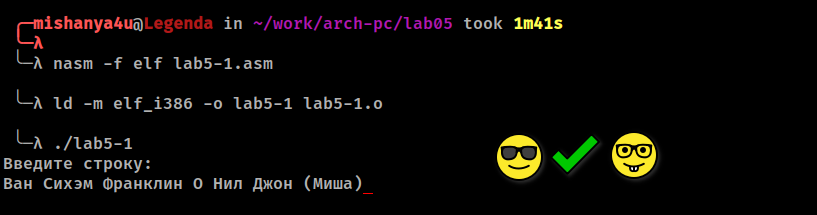<hr><hr>

<br>


9. <ins>Скачайте файл in_out.asm со страницы курса в ТУИС</ins>


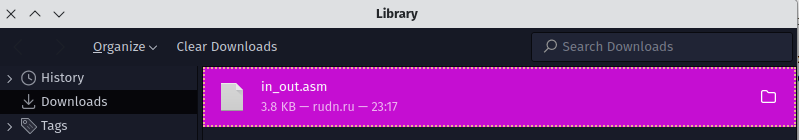<hr><hr>

<br>

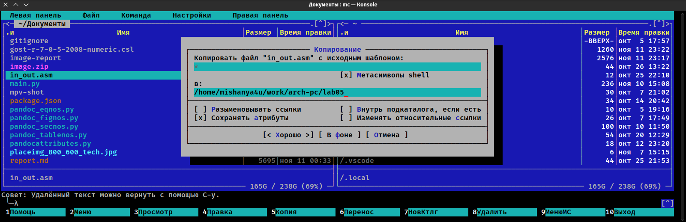<hr><hr>

<br>


10. <ins>Подключаемый файл in_out.asm должен лежать в том же каталоге, что и файл с программой, в которой он используется. В одной из панелей mc откройте каталог с файлом lab5-1.asm. В другой панели каталог со скаченным файлом in_out.asm (для перемещения между панелями используйте Tab. Скопируйте файл in_out.asm в каталог с файлом lab5-1.asm с помощью функциональной клавиши F5.</ins>


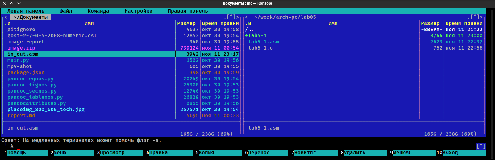<hr><hr>

<br>

<hr><hr>

<br>

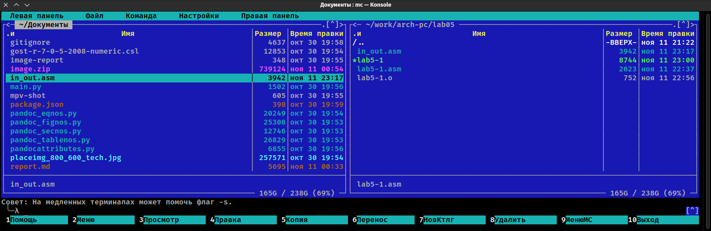<hr><hr>

<br>


11. <ins>С помощью функциональной клавиши F6 создайте копию файла lab5-1.asm с именем lab5-2.asm.</ins>


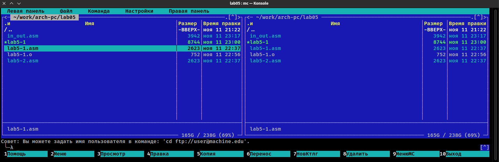<hr><hr>

<br>


12. <ins>Исправьте текст программы в файле lab5-2.asm с использование подпрограмм из внешнего файла in_out.asm (используйте подпрограммы sprintLF, sread и quit) в соответствии с листингом 5.2. Создайте исполняемый файл и проверьте его работу.</ins>


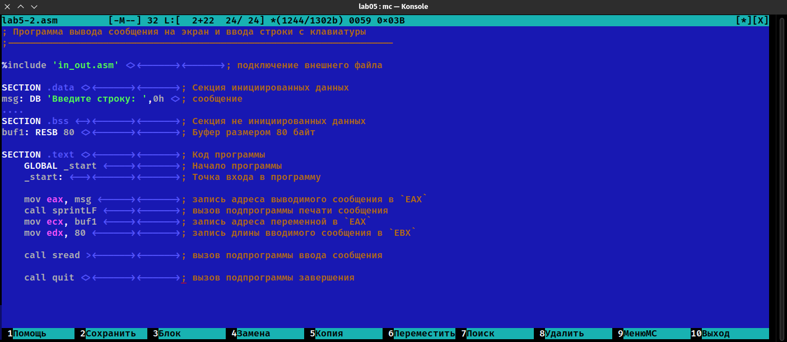<hr><hr>

<br>


13. <ins>В файле lab5-2.asm замените подпрограмму sprintLF на sprint. Создайте исполняемый файл и проверьте его работу. В чем разница?</ins>


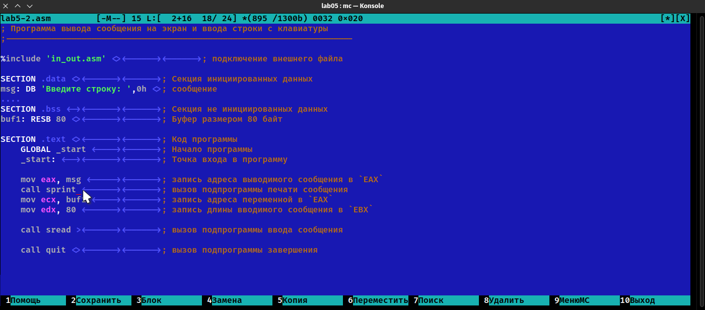<hr><hr>

<br>


sprint – вывод сообщения на экран, перед вызовом sprint в регистр eax необходимо
записать выводимое сообщение (mov eax, message) а sprintLF также работает но при выводе на экран добавляет к сообщению символ перевода строки.


## Задание для самостоятельной работы

1. <ins>Создайте копию файла lab5-1.asm. Внесите изменения в программу (без использования внешнего файла in_out.asm), так чтобы она работала по следующему алгоритму:</ins>
- вывести приглашение типа “Введите строку:”;
- ввести строку с клавиатуры;
- вывести введённую строку на экран.


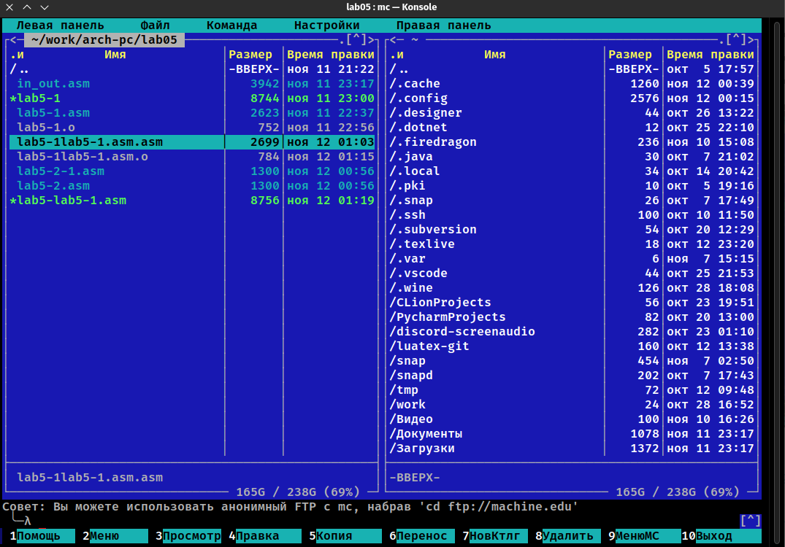<hr><hr>

<br>

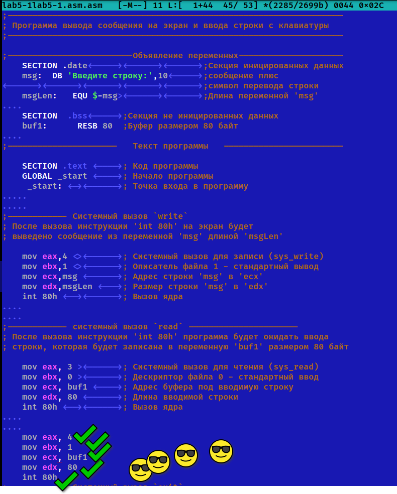<hr><hr>

<br>


2. <ins>Получите исполняемый файл и проверьте его работу. На приглашение ввести строку введите свою фамилию.</ins>


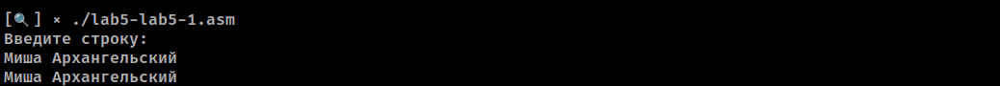<hr><hr>

<br>


3. <ins>Создайте копию файла lab5-2.asm. Исправьте текст программы с использование подпрограмм из внешнего файла in_out.asm, так чтобы она работала по следующему алгоритму:</ins>
- вывести приглашение типа “Введите строку:”;
- ввести строку с клавиатуры;
- вывести введённую строку на экран.


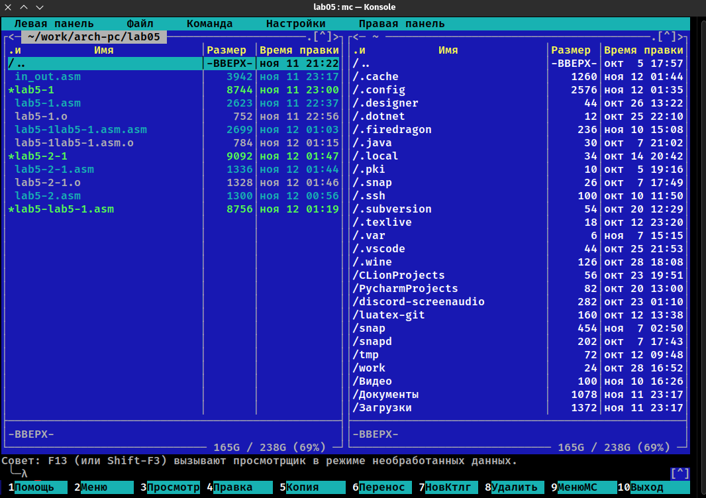<hr><hr>

<br>

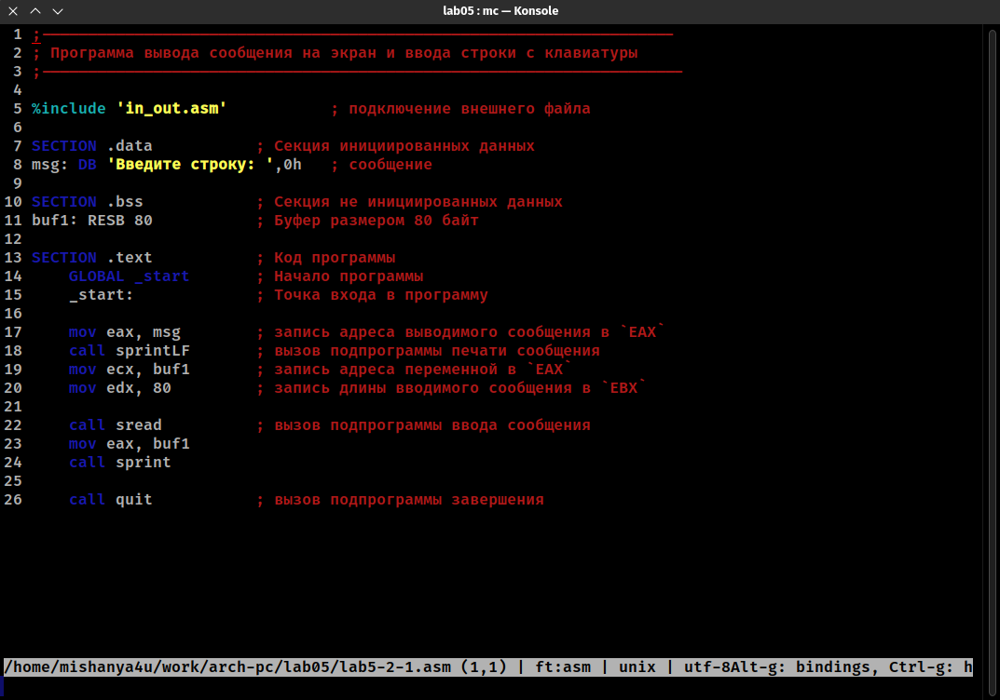<hr><hr>

<br>


4. <ins>Создайте исполняемый файл и проверьте его работу.</ins>


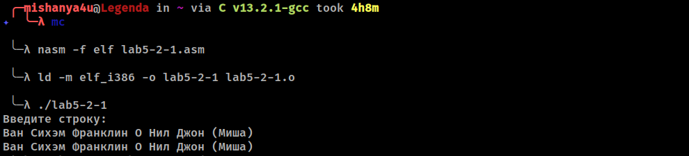<hr><hr>

<br>


## Листинг 5.1

```nasm
;------------------------------------------------------------------
; Программа вывода сообщения на экран и ввода строки с клавиатуры
;------------------------------------------------------------------
;------------------- Объявление переменных ----------------
SECTION .data                   ; Секция инициированных данных
msg: DB 'Введите строку:',10    ; сообщение плюс
                                ; символ перевода строки
msgLen: EQU $-msg               ; Длина переменной 'msg'

SECTION .bss        ; Секция не инициированных данных
buf1: RESB 80       ; Буфер размером 80 байт

;------------------- Текст программы -----------------

SECTION .text 	   ; Код программы
GLOBAL _start	   ; Начало программы
 _start: 	       ; Точка входа в программу

;------------ Cистемный вызов `write`
; После вызова инструкции 'int 80h' на экран будет
; выведено сообщение из переменной 'msg' длиной 'msgLen'

	mov eax,4 ; Системный вызов для записи (sys_write)
	mov ebx,1 ; Описатель файла 1 - стандартный вывод
	mov ecx,msg ; Адрес строки 'msg' в 'ecx'
	mov edx,msgLen ; Размер строки 'msg' в 'edx'
	int 80h ; Вызов ядра
	
;------------ системный вызов `read` ----------------------
; После вызова инструкции 'int 80h' программа будет ожидать ввода
; строки, которая будет записана в переменную 'buf1' размером 80 байт

	mov eax, 3 ; Системный вызов для чтения (sys_read)
	mov ebx, 0 ; Дескриптор файла 0 - стандартный ввод
	mov ecx, buf1 ; Адрес буфера под вводимую строку
	mov edx, 80 ; Длина вводимой строки
	int 80h ; Вызов ядра
	
;------------ Системный вызов `exit` ----------------------
; После вызова инструкции 'int 80h' программа завершит работу

	mov eax,1 ; Системный вызов для выхода (sys_exit)
	mov ebx,0 ; Выход с кодом возврата 0 (без ошибок)
	int 80h ; Вызов ядра

```

## Листинг 5.2

```nasm
;--------------------------------------------------------------------
; Программа вывода сообщения на экран и ввода строки с клавиатуры
;---------------------------------------------------------------------

%include 'in_out.asm' 		       ; подключение внешнего файла

SECTION .data 			     ; Секция инициированных данных
msg: DB 'Введите строку: ',0h ; сообщение

SECTION .bss 		; Секция не инициированных данных
buf1: RESB 80 		; Буфер размером 80 байт

SECTION .text 		; Код программы
	GLOBAL _start 	; Начало программы
	_start: 			; Точка входа в программу

	mov eax, msg 	; запись адреса выводимого сообщения в `EAX`
	call sprintLF 	; вызов подпрограммы печати сообщения
	mov ecx, buf1 	; запись адреса переменной в `EAX`
	mov edx, 80 		; запись длины вводимого сообщения в `EBX`

	call sread 		; вызов подпрограммы ввода сообщения

	call quit 	    ; вызов подпрограммы завершения
```

# Заключение

После работы с Midnight Commander, могу сказать что МС очень простой и интуитивно понятный интерфейс, который позволяет легко навигировать по файловой системе и выполнять нужные операции. Он также поддерживает работу с архивами, просмотр и редактирование текстовых файлов, а также поддерживает множество других фунций, которые делают его очень полезным инструментом для системного администратора или разработчика.


::: {#refs}
:::
