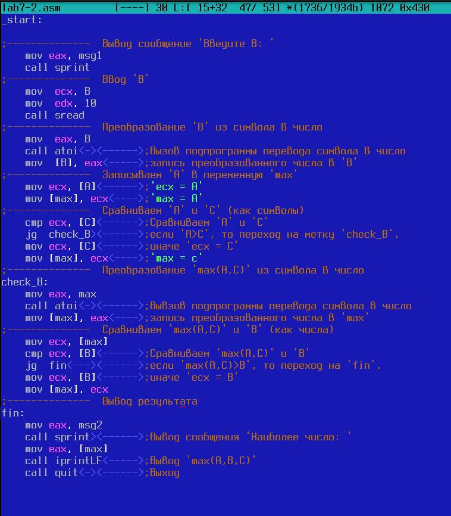
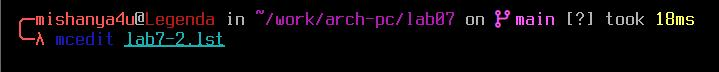
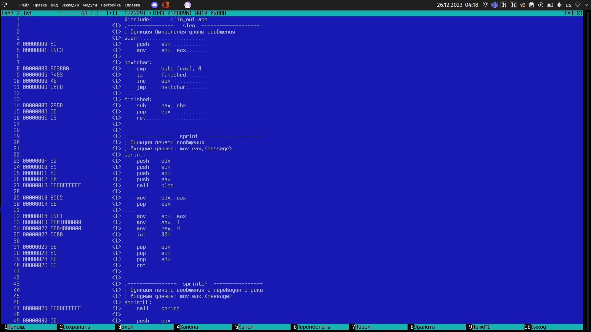
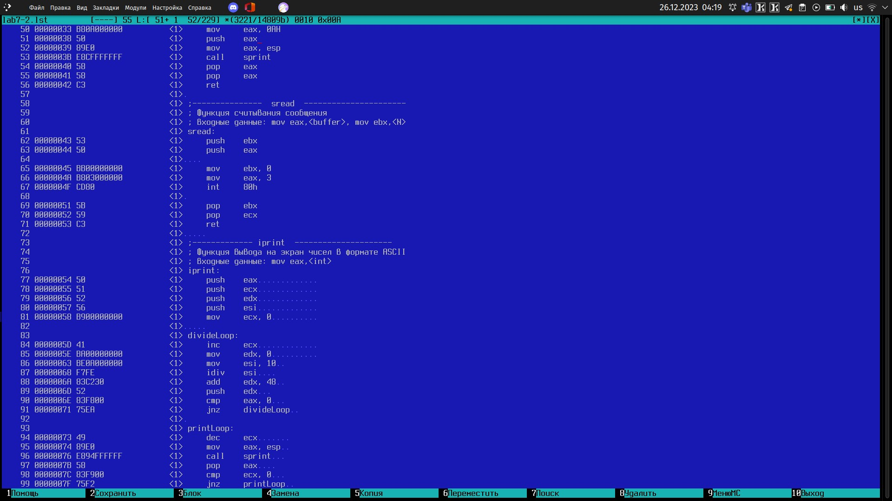
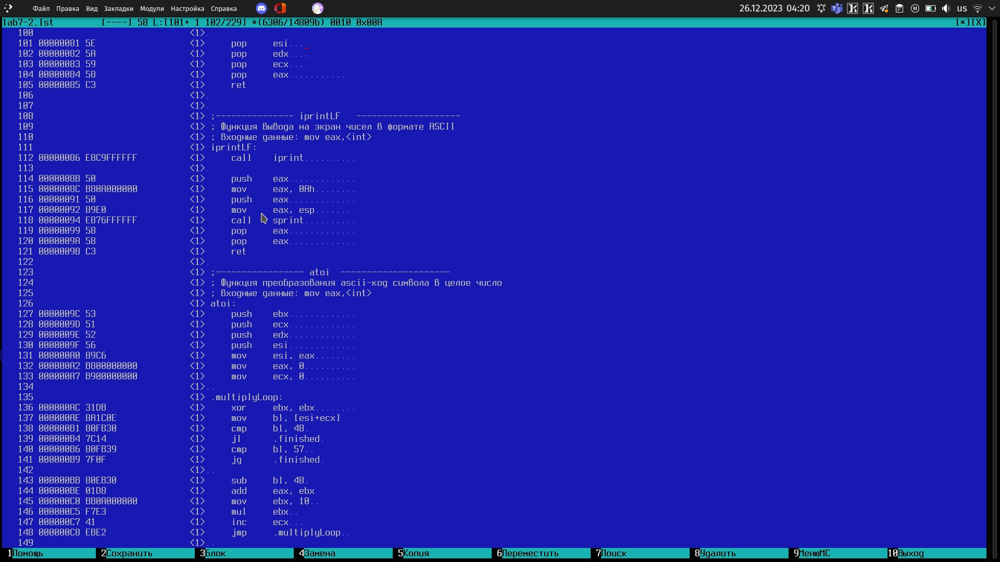
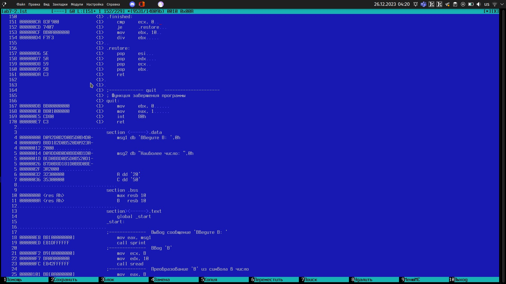

---
## Front matter
title: "Шаблон отчёта по лабораторной работе № 7"
subtitle: "Команды безусловного и
условного переходов в Nasm. Программирование
ветвлений"
author: "Ван Сихэм Франклин О Нил Джон (Миша)"

## Generic otions
lang: ru-RU
toc-title: "Содержание"

## Bibliography
bibliography: bib/cite.bib
csl: pandoc/csl/gost-r-7-0-5-2008-numeric.csl

## Pdf output format
toc: true # Table of contents
toc-depth: 2
lof: true # List of figures
lot: true # List of tables
fontsize: 12pt
linestretch: 1.5
papersize: a4
documentclass: scrreprt
## I18n polyglossia
polyglossia-lang:
  name: russian
  options:
	- spelling=modern
	- babelshorthands=true
polyglossia-otherlangs:
  name: english
## I18n babel
babel-lang: russian
babel-otherlangs: english
## Fonts
mainfont: PT Serif
romanfont: PT Serif
sansfont: PT Sans
monofont: PT Mono
mainfontoptions: Ligatures=TeX
romanfontoptions: Ligatures=TeX
sansfontoptions: Ligatures=TeX,Scale=MatchLowercase
monofontoptions: Scale=MatchLowercase,Scale=0.9
## Biblatex
biblatex: true
biblio-style: "gost-numeric"
biblatexoptions:
  - parentracker=true
  - backend=biber
  - hyperref=auto
  - language=auto
  - autolang=other*
  - citestyle=gost-numeric
## Pandoc-crossref LaTeX customization
figureTitle: "Рис."
tableTitle: "Таблица"
listingTitle: "Листинг"
lofTitle: "Список иллюстраций"
lotTitle: "Список таблиц"
lolTitle: "Листинги"
## Misc options
indent: true
header-includes:
  - \usepackage{indentfirst}
  - \usepackage{float} # keep figures where there are in the text
  - \floatplacement{figure}{H} # keep figures where there are in the text
---

# Цель работы

Изучение команд условного и безусловного переходов. Приобретение навыков написания
программ с использованием переходов. Знакомство с назначением и структурой файла
листинга.

# Порядок выполнения лабораторной работы

## Реализация переходов в NASM

1. Создайте каталог для программам лабораторной работы No 7, перейдите в него и создайте файл lab7-1.asm:

```
mkdir ~/work/arch-pc/lab07
cd ~/work/arch-pc/lab07
touch lab7-1.asm
```

<hr>

2. Инструкция jmp в NASM используется для реализации безусловных переходов. Рассмотрим пример программы с использованием инструкции jmp. Введите в файл lab7-1.asm текст программы из листинга 7.1.

**Листинг 7.1. Программа с использованием инструкции jmp**

```nasm
%include 'in_out.asm'  ; подключение внешнего файла

SECTION .data
 msg1: DB 'Сообщение No 1',0
 msg2: DB 'Сообщение No 2',0
 msg3: DB 'Сообщение No 3',0

SECTION .text
GLOBAL _start
 _start:

 jmp _label2
 
 _label1:
 mov eax, msg1  ; Вывод на экран строки
 call sprintLF  ; 'Сообщение No 1'

 _label2:
 mov eax, msg2   ; Вывод на экран строки
 call sprintLF   ; 'Сообщение No 2'

 _label3:
 mov eax, msg3   ; Вывод на экран строки
 call sprintLF   ; 'Сообщение No 3'

 _end:
   call quit       ; вызов подпрограммы завершения
```

<hr>

Создайте исполняемый файл и запустите его. Результат работы данной программы будет следующим:

```
user@dk4n31:~$ ./lab7-1
сообщение №2 
сообщение №3
user@dk4n31:~$ 
```

<hr>

Таким образом, использование инструкции ```jmp _label2``` меняет порядок исполнения инструкций и позволяет выполнить инструкции начиная с метки ```_label2```, пропустив вывод первого сообщения. Инструкция ```jmp``` позволяет осуществлять переходы не только вперед но и назад. Изменим программу таким образом, чтобы она выводила сначала ```‘Сообщение No 2’```, потом ```‘Сообщение No 1’``` и завершала работу. Для этого в текст программы после вывода сообщения No 2 добавим инструкцию ```jmp``` с меткой ```_label1``` (т.е. переход к инструкциям вывода сообщения No 1) и после вывода сообщения No 1 добавим инструкцию ```jmp``` с меткой ```_end``` (т.е. переход к инструкции ```call quit```). Измените текст программы в соответствии с листингом 7.2.

<hr>

<hr>

**Листинг 7.2. Программа с использованием инструкции jmp**

```nasm
%include 'in_out.asm'  ; подключение внешнего файла

 SECTION .data
 msg1: DB 'Сообщение No 1',0
 msg2: DB 'Сообщение No 2',0
 msg3: DB 'Сообщение No 3',0

 SECTION .text
 GLOBAL _start
  _start:

 jmp _label2
 
 _label1:
 mov eax, msg1    ; Вывод на экран строки
 call sprintLF    ; 'Сообщение No 1'
 jmp _end

 _label2:
 mov eax, msg2    ; Вывод на экран строки
 call sprintLF    ; 'Сообщение No 2'
 jmp _label1

 _label3:
 mov eax, msg3    ; Вывод на экран строки
 call sprintLF    ; 'Сообщение No 3'
 
 _end:
   call quit        ; вызов подпрограммы завершения
 ```

<hr>

Создайте исполняемый файл и проверьте его работу.
Измените текст программы добавив или изменив инструкции jmp, чтобы вывод программы был следующим:

```
user@dk4n31:~$ ./lab7-1
Сообщение No 3
Сообщение No 2
Сообщение No 1
user@dk4n31:~$
```

<hr>

3. Использование инструкции jmp приводит к переходу в любом случае. Однако, часто при написании программ необходимо использовать условные переходы, т.е. переход должен происходить если выполнено какое-либо условие. В качестве примера рассмотрим программу, которая определяет и выводит на экран наибольшую из 3 целочисленных переменных: A,B и C. Значения для A и C задаются в программе, значение B вводиться с клавиатуры.

Создайте файл lab7-2.asm в каталоге ~/work/arch-pc/lab07. Внимательно изучите текст программы из листинга 7.3 и введите в lab7-2.asm.

<hr>

**Листинг 7.3. Программа, которая определяет и выводит на экран наибольшую из 3
целочисленных переменных: A,B и C.**

```nasm
%include 'in_out.asm'

section        .data
	msg1 db 'Введите B: ',0h
	msg2 db "Наибольшее число: ",0h
	A dd '20'
	C dd '50'
section .bss
   	max resb 10
	B resb 10

section .text
global _start
 _start:

; ----------  Вывод сообщения 'Введите B: '
 mov eax,msg1
 call sprint

; ----------  Ввод 'B'

 mov ecx,B
 mov edx,10
 call sread

; ----------  Преобразование 'B' из символа в число

 mov eax,B
 call atoi     ; Вызов подпрограммы перевода символа в число
 mov [B],eax   ; запись преобразованного числа в 'B'

; ----------  Записываем 'A' в переменную 'max'

 mov ecx,[A]   ; 'ecx = A'
 mov [max],ecx ; 'max = A'

; ----------  Сравниваем 'A' и 'С' (как символы)
 
 cmp ecx,[C]   ; Сравниваем 'A' и 'С'
 jg check_B    ; если 'A>C', то переход на метку 'check_B',

 mov ecx,[C]   ; иначе 'ecx = C'
 mov [max],ecx ; 'max = C'

; ----------  Преобразование 'max(A,C)' из символа в число

 check_B:
 	mov eax,max
 	call atoi     ; Вызов подпрограммы перевода символа в число
	mov [max],eax ; запись преобразованного числа в `max`

; ----------  Сравниваем 'max(A,C)' и 'B' (как числа)

 mov ecx,[max]
 cmp ecx,[B]      ; Сравниваем 'max(A,C)' и 'B'
 jg  fin          ; если 'max(A,C)>B', то переход на 'fin',
 mov ecx,[B]      ; иначе 'ecx = B'
 mov  [max],ecx

 ; ----------   Вывод результата
 
 fin:
	mov  eax, msg2
	call sprint    ; Вывод сообщения 'Наибольшее число: '
	mov  eax,[max]
	call iprintLF  ; Вывод 'max(A,B,C)'
    call quit      ; Выход
```

<hr>

Создайте исполняемый файл и проверьте его работу для разных значений B. Обратите внимание, в данном примере переменные A и С сравниваются как символы, 0а переменная B и максимум из A и С как числа (для этого используется функция atoi преобразования символа в число). Это сделано для демонстрации того, как сравниваются данные. Данную программу можно упростить и сравнивать все 3 переменные как символы (т.е. не использовать функцию atoi). Однако если переменные преобразовать из символов числа, над ними можно корректно проводить арифметические операции.

<hr>

## Изучение структуры файлы листинга

4. Обычно nasm создаёт в результате ассемблирования только объектный файл. Получить файл листинга можно, указав ключ -l и задав имя файла листинга в командной строке. Создайте файл листинга для программы из файла lab7-2.asm

```
nasm -f elf -l lab7-2.lst lab7-2.asm
```

<hr>

Откройте файл листинга lab7-2.lst с помощью любого текстового редактора, например
mcedit:

```
mcedit lab7-2.lst
```

<hr>

<hr>

<hr>

<hr>

<hr>

<hr>

Внимательно ознакомиться с его форматом и содержимым. Подробно объяснить содержи-
мое трёх строк файла листинга по выбору.

- 127 строка:
 1. **0000009C** - адрес
 2. **53** - машинный код
 3. **push ebx** - используется для помещения значения регистра EBX на вершину стека. Когда происходит операция push, значение регистра EBX сохраняется на вершине стека, а указатель стека увеличивается на размер одного элемента (обычно 4 байта для 32-битной архитектуры).<hr>

- 128 строка:
 1. **0000009D** - адрес
 2. **51** - машинный код
 3. **push ecx** - используется для помещения значения регистра EBX на вершину стека. Когда происходит операция push, значение регистра EBX сохраняется на вершине стека, а указатель стека увеличивается на размер одного элемента (обычно 4 байта для 32-битной архитектуры).<hr>

- 129 строка:
 1. **0000009E** - адрес
 2. **52** - машинный код
 3. **push edx** - используется для помещения значения регистра EBX на вершину стека. Когда происходит операция push, значение регистра EBX сохраняется на вершине стека, а указатель стека увеличивается на размер одного элемента (обычно 4 байта для 32-битной архитектуры).<hr>

<hr>

Откройте файл с программой lab7-2.asm и в любой инструкции с двумя операндами удалить один операнд. 

<hr>

<hr>

Выполните трансляцию с получением файла листинга:

```
nasm -f elf -l lab7-2.lst lab7-2.asm
```

Какие выходные файлы создаются в этом случае? Что добавляется в листинге?

```В этот раз lab7-2.o не был создан только lab7-2.lst. В листинге пишет что появился сбой: недопустимая комбинация кода операции и операндов```

<hr>


# Задание для самостоятельной работы

1. Напишите программу нахождения наименьшей из 3 целочисленных переменных a,b и с. Значения переменных выбрать из табл. 7.5 в соответствии с вариантом, полученным при выполнении лабораторной работы No 7. Создайте исполняемый файл и проверьте его работу.

<hr><hr>

<hr><hr>


2. Напишите программу, которая для введенных с клавиатуры значений x и a вычисляет значение заданной функции f(x) и выводит результат вычислений. Вид функции f(x) выбрать из таблицы 7.6 вариантов заданий в соответствии с вариантом, полученным при выполнении лабораторной работы No 7. Создайте исполняемый файл и проверьте его работу для значений x и a из 7.6.

```nasm

%include 'in_out.asm'

section .data
msg1 DB 'Введите x: ',0h
msg2 DB 'Введите a: ',0h
msg3: DB 'Ответ: ',0h

section .bss
	x: RESB 80
	a: RESB 80
	r: RESB 80

section .text
global _start
 _start:
	mov eax,msg1
	call sprint

	mov ecx,x
	mov edx,80
	call sread

	mov eax,x
	call atoi
	mov [x],eax
	
	mov eax,msg2
	call sprint
	
	mov ecx,a
	mov edx,80
	call sread
	
	mov eax,a
	call atoi
	mov [a],eax
	
	mov eax, [x]
	cmp eax, 3
	je x_ravno_3
	
	mov eax, [a]
	add eax, 1
	jmp res
	
	x_ravno_3:
	mov eax, [x]
	imul eax,3
	
	res:
	mov [r],eax
	
	fin:
	mov eax,msg3
	call sprint
	mov eax,[r]
	call iprintLF
	call quit
```


# Заключение

Теперь могу сказать, что умею создавать программы на ассемблере, которые могут принимать различные решения в зависимости от условий.